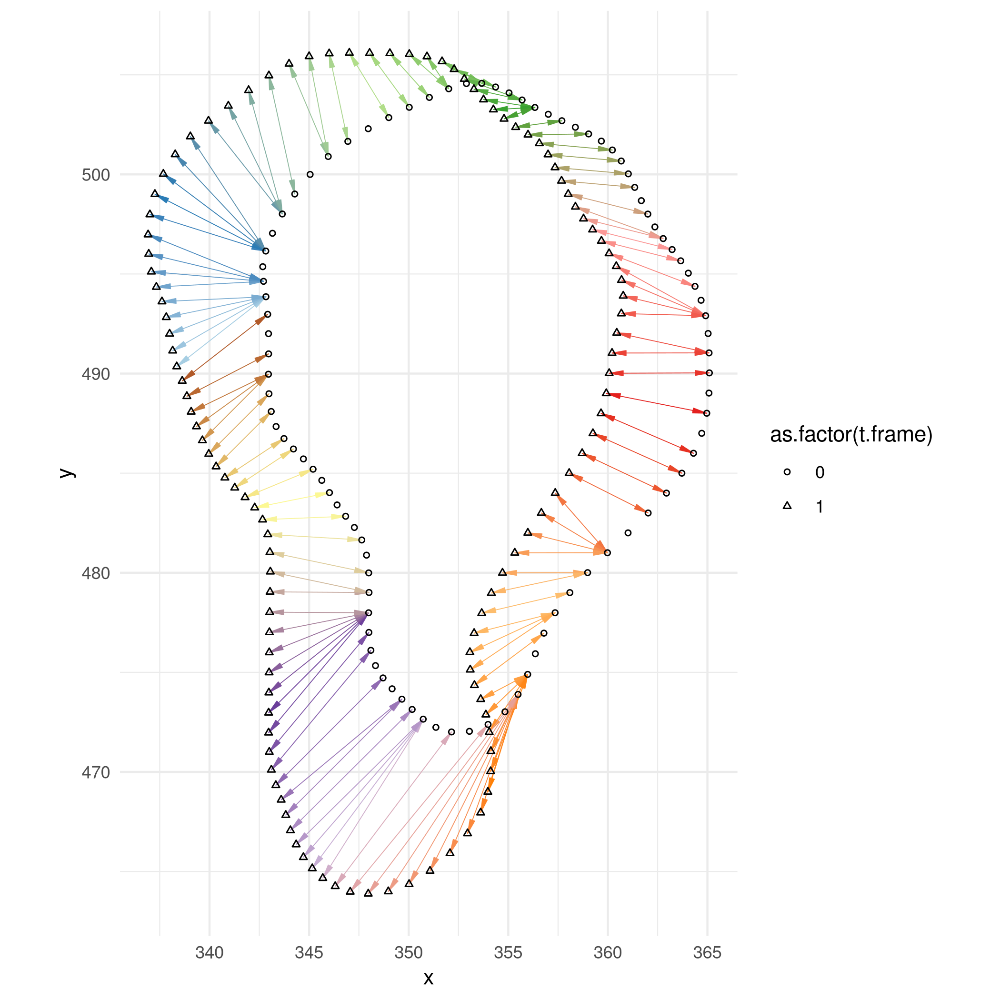

# Descripción de archivos

* `curvature_tests.Rmd`: notebook en limpio (WIP).
    * `curvature_tests_old.Rmd`: versión vieja.
* `03-boundary_angles.Rmd`: notebook original donde probé el código, copiado del experimento `gitlabs_acl/rtcc/far1/20210826-pruebaexpSkotheim1-lavemaso`.

Output que generé con el alineamiento de boundaries con DTW:
 

